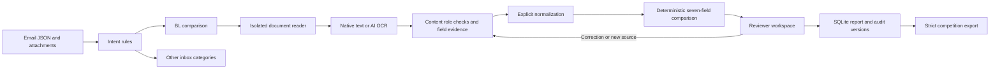

# Design and boundaries

Harbor assists a shipping operations reviewer. SI is the reference. A matching report means that all seven required values passed the implemented checks. It is not authorization to release a shipment.

## Decisions

Email routing is deterministic intent matching with current-message segmentation. A specific opening request takes precedence over an unrelated notice later in the body. Subject fallback is secondary. The rule matched and source text remain visible. Unknown wording defaults to GENERAL with a routing-review flag in the report; the present UI does not offer manual category reassignment. A learned classifier is a future extension, not an implemented capability.

Document roles derive from content headings. A file called BL that contains a commercial invoice is not accepted as a bill of lading. Duplicate or unknown roles require review. The prototype expects exactly one SI and one BL. Multiple shipment groups in a single email need future grouping support.

TXT retains line numbers. PDF retains page and text-line positions. OCR adds bounding boxes. Word retains paragraph or table-row positions. Spreadsheet rows retain sheet and cell references. Source hashes bind human corrections to the exact file version. Native PDF extraction is reading-order based, not a general visual table understanding model.

Container normalization consumes the full expression, supports explicit quantities and common 20/40/45-foot size descriptors, and rejects unparsed remnants. It compares quantity only, as required by the task. It does not verify whether the container types are commercially interchangeable.

Weight normalization uses decimal arithmetic without tolerance, respects explicit value or label units, converts metric tonnes and pounds, and rejects unqualified tons and ambiguous comma decimals. A bare GROSS WEIGHT uses the competition field's kilogram convention; the report discloses this assumption. Real deployment must confirm that convention or require an explicit unit. An explicit total takes precedence over an item weight. Conflicting totals require review. General multi-column commodity table aggregation is not implemented.

Entity and port comparison removes case, punctuation and whitespace while retaining words and digits. No unverified alias or fuzzy entity merging is used. This can cause conservative false mismatches for real aliases. It can also collapse token boundaries, so production needs approved identity rules and a representative validation set. No accuracy claim extends beyond the measured input formats.

## Human review and persistence

Automatic records are insert-only originals. Each correction stores the old observation, confirmed value, reviewer name, reason, timestamp and report version. Values the parser did not locate require the reviewer to record a source location. The original document remains unchanged. New files have unique storage names and retained old versions. Optimistic version checks prevent stale browser forms overwriting newer decisions.

Retries preserve human decisions only when source hashes match. Changed source files invalidate affected confirmations. This prevents a corrected extraction value from silently surviving a materially changed carrier draft.

SQLite transactions provide persistence, not a tamper-proof ledger. Reviewer identity is not authenticated. Production requires role-based access, retention controls, backups and append-only audit storage appropriate to the business.

## Failure handling and portability

Readers run in bounded subprocesses. File size, PDF pages and spreadsheet dimensions have limits. Formulas and macros are not executed. An unreadable source blocks automatic clearance. A timeout can be retried; corrections already in storage survive. Replacement is the recovery path for damaged PDFs.

Apple Vision OCR runs on macOS. The Linux/cloud container uses Tesseract and retains page bounding boxes. If neither backend is installed, scans remain visible review cases. OCR does not provide calibrated business confidence and is never sufficient for automatic approval: every scanned value requires human confirmation.

## Public cloud sandbox

Public mode is intentionally separate from the private workspace. It packages seven owned synthetic cases, disables arbitrary uploads, rate-limits writes, resets reports on startup and provides an explicit reset action. It does not contain organizer inputs, ground truth, generator code or a private runtime database. Container health checks cover the web process, SQLite access, demo seeding and OCR-backend visibility. Shared synthetic writes are acceptable for judging; production requires per-user isolation and authentication.

## Evaluator adapter

Internal waiting-for-documents is distinct from verified match. Some ordinary requests for a draft BL map to OK in the organizer convention even without attachments. The UI explicitly says no verification occurred. Scans remain NEEDS_REVIEW despite partial readable OCR. Partial known defects are visible internally even when unresolved fields require the overall NEEDS_REVIEW export.

## Production extensions

The competition requires meaningful AI and cloud infrastructure but prescribes no vendor. Harbor uses cloud container hosting plus computer-vision OCR for image-only documents; explicit code handles normalization, comparison and safety gates. The most useful future work is a real-data pilot, stronger layout understanding and category correction, followed by authenticated review and mailbox integration. A complex multi-agent workflow is not required by the current problem.
